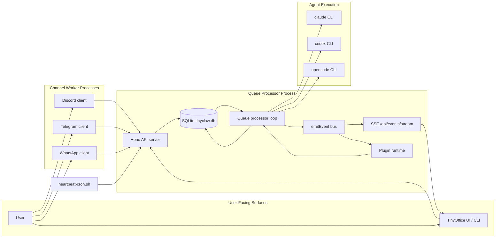
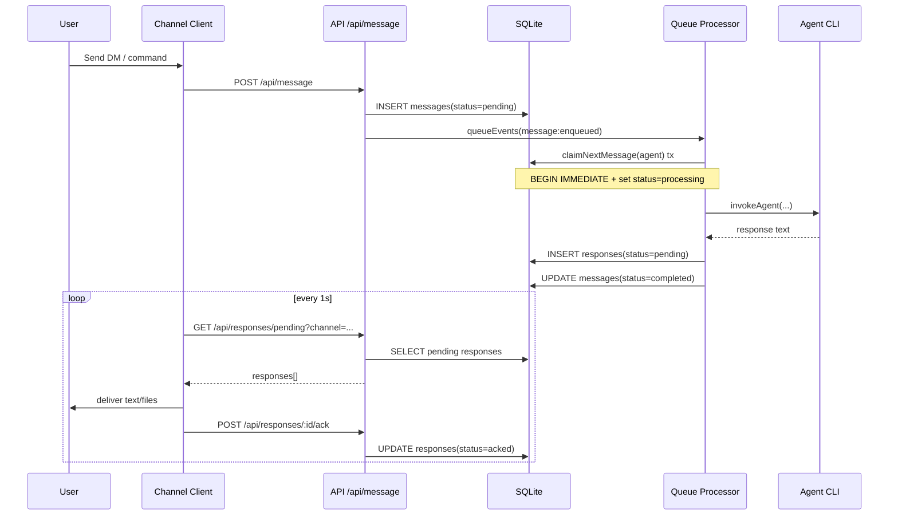
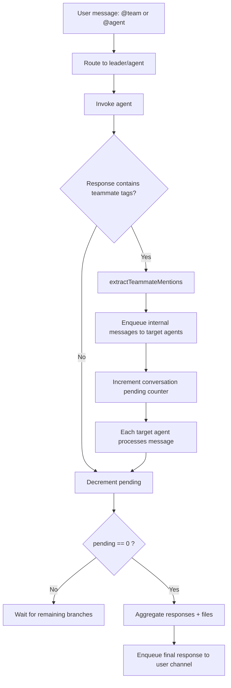
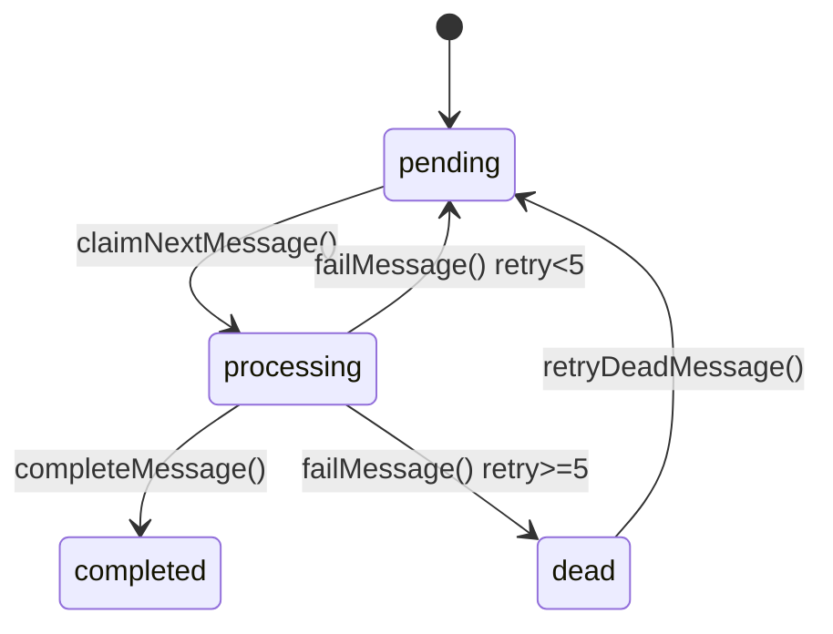
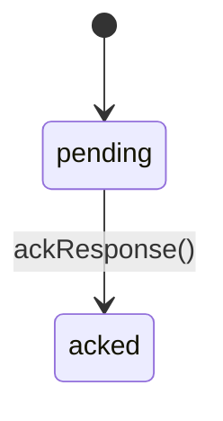

# DEVELOPER\_README

This document explains how TinyClaw is wired internally for developers working on the runtime, queue orchestration, and agent collaboration model.



### 1) Runtime Architecture

TinyClaw runs as a tmux-managed multi-process system. The queue processor process hosts both:

* the API server (`Hono`)
* the core queue engine (SQLite-backed message orchestration)

Channel clients (Discord, Telegram, WhatsApp) run as separate processes and communicate with the API over HTTP.





### 2) End-to-End Message Lifecycle

Inbound and outbound messaging are both orchestrated via SQLite tables:

* `messages`: inbound queue
* `responses`: outbound queue





### 3) Agent-to-Agent Team Communication

There is no central "team orchestrator" object. Team collaboration emerges from queue messages:

* leader agent is invoked first
* teammate mentions (`[@agent: message]`) become new internal queue entries
* each target agent runs on its own sequential chain
* branches run in parallel across different agents



Concurrency model:

* same agent: strict FIFO via per-agent promise chain (`agentProcessingChains`)
* different agents: concurrent execution
* conversation completion is lock-protected (`withConversationLock`) to avoid race conditions when multiple branches finish together



### 4) SQLite as the Communication Orchestrator

DB path:

* `${TINYCLAW_HOME}/tinyclaw.db`

SQLite settings at init:

* `journal_mode=WAL`
* `busy_timeout=5000`

Core tables:

* `messages` (inbound work queue with retries, dead-letter state)
* `responses` (outbound delivery queue with ack state)

```mermaid
erDiagram
    MESSAGES {
        INTEGER id PK
        TEXT message_id UNIQUE
        TEXT channel
        TEXT sender
        TEXT sender_id
        TEXT message
        TEXT agent
        TEXT files
        TEXT conversation_id
        TEXT from_agent
        TEXT status
        INTEGER retry_count
        TEXT last_error
        TEXT claimed_by
        INTEGER created_at
        INTEGER updated_at
    }

    RESPONSES {
        INTEGER id PK
        TEXT message_id
        TEXT channel
        TEXT sender
        TEXT sender_id
        TEXT message
        TEXT original_message
        TEXT agent
        TEXT files
        TEXT metadata
        TEXT status
        INTEGER created_at
        INTEGER acked_at
    }

    MESSAGES ||--o{ RESPONSES : "logical link by message_id"
```

Message state machine:



Response state machine:



Why this works for orchestration:

* atomic claim (`BEGIN IMMEDIATE`) prevents two workers claiming the same message
* status transitions are explicit and queryable
* channel delivery is decoupled from model execution via `responses` queue
* retries and dead-letter handling are first-class in DB, not in-memory only



### 5) Event and Observability Pipeline

`emitEvent(...)` is the shared in-process event bus. It fans out to:

* SSE broadcaster (`/api/events/stream`) for TinyOffice and visualizer
* plugin event handlers (`onEvent` integration)

Event examples:

* `message_received`
* `agent_routed`
* `chain_step_start`
* `chain_step_done`
* `chain_handoff`
* `team_chain_start`
* `team_chain_end`
* `response_ready`



### 6) Source Map (Where to Change What)

* `src/queue-processor.ts`: message processing engine, team conversation lifecycle
* `src/lib/db.ts`: SQLite schema + claim/retry/ack primitives
* `src/lib/conversation.ts`: internal message enqueue + conversation completion
* `src/lib/routing.ts`: `@agent` / `@team` routing and teammate mention extraction
* `src/lib/invoke.ts`: provider-specific CLI invocation (Claude/Codex/OpenCode)
* `src/lib/plugins.ts`: incoming/outgoing hooks and plugin event wiring
* `src/server/index.ts`: API + route mounting + SSE endpoint
* `src/server/routes/*.ts`: REST surface (`/api/message`, `/api/responses`, queue, config)
* `src/channels/*.ts`: channel adapters and outbound ack loops
* `lib/daemon.sh`: tmux process layout and daemon lifecycle
* `lib/heartbeat-cron.sh`: scheduled prompts to all agents



### 7) Developer Workflow

Build and run core runtime:

```bash
npm run build
./tinyclaw.sh start
```

Useful endpoints while developing:

* `GET /api/queue/status`
* `GET /api/queue/dead`
* `GET /api/responses?limit=50`
* `GET /api/events/stream`

Useful logs:

* `${TINYCLAW_HOME}/logs/queue.log`
* `${TINYCLAW_HOME}/logs/discord.log`
* `${TINYCLAW_HOME}/logs/telegram.log`
* `${TINYCLAW_HOME}/logs/whatsapp.log`
* `${TINYCLAW_HOME}/logs/heartbeat.log`



### 8) Practical Notes

* Team chats are persisted as markdown under `${TINYCLAW_HOME}/chats/{team_id}/`.
* Agent workspace bootstrap copies `AGENTS.md`, `.claude/`, skills, and `SOUL.md` into each agent working directory.
* `responses.metadata` is available for plugin-driven delivery hints (for example parse mode).
* Outbound file attachments are discovered from `[send_file: /absolute/path]` tags.


