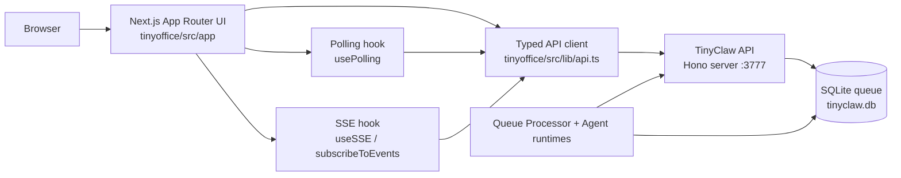
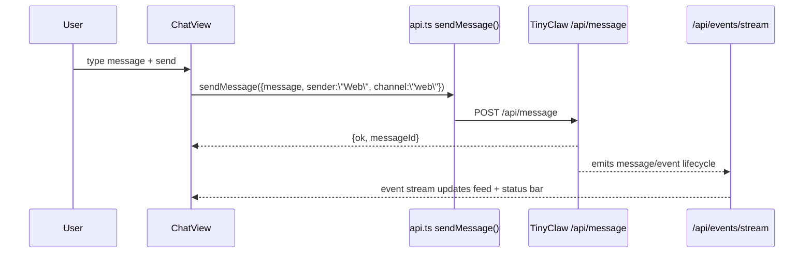
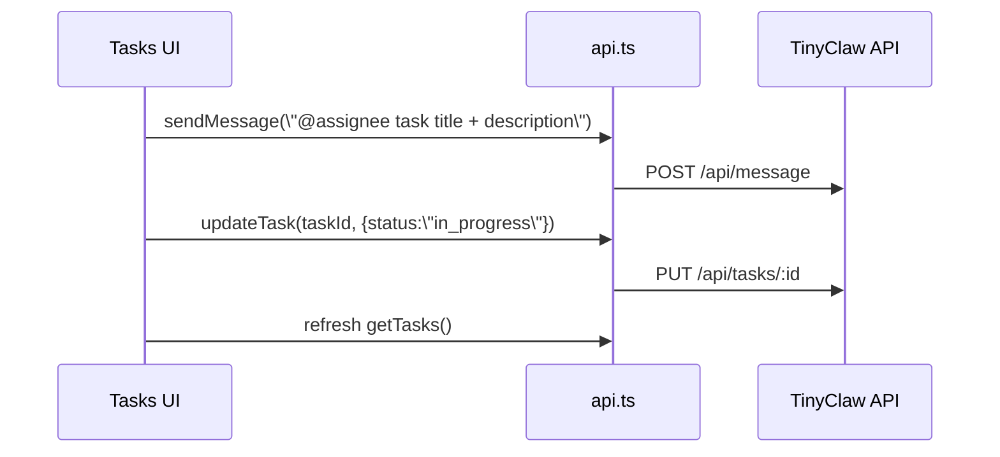

# TINYOFFICE\_DEVELOPER\_README

This document describes TinyOffice internals for contributors working on the Next.js web UI and its integration with TinyClaw APIs.

## 1) What TinyOffice Is

TinyOffice is a client-heavy Next.js app (`tinyoffice/`) that operates TinyClaw through:

* REST calls to the TinyClaw API (`http://localhost:3777` by default)
* SSE subscriptions to live runtime events (`/api/events/stream`)

TinyOffice does not execute agent logic itself. It is an operational UI layer over the queue processor backend.

## 2) Runtime Architecture



## 3) Frontend Structure

Primary directories:

* `tinyoffice/src/app`: route pages (all current pages are client components)
* `tinyoffice/src/components`: shared UI components (`Sidebar`, `ChatView`)
* `tinyoffice/src/components/ui`: design system primitives + Kanban DnD primitives
* `tinyoffice/src/lib`: API client, hooks, shared utilities

Layout model:

* `src/app/layout.tsx` renders permanent left sidebar + right content panel
* global theme tokens and animations live in `src/app/globals.css`
* dark mode is forced via `<html className="dark">`

## 4) Route Map and Data Contracts

```mermaid
flowchart TD
    ROOT[/]
    CONSOLE[/console]
    AGENTS[/agents]
    TEAMS[/teams]
    TASKS[/tasks]
    LOGS[/logs]
    SETTINGS[/settings]
    OFFICE[/office]
    ACHAT[/chat/agent/:id]
    TCHAT[/chat/team/:id]

    ROOT -->|poll agents/teams/queue + SSE| API1[(TinyClaw API)]
    CONSOLE -->|send message + SSE| API1
    ACHAT -->|send @agent + poll agents + SSE| API1
    TCHAT -->|send @team + poll teams/agents + SSE| API1
    AGENTS -->|GET/PUT/DELETE agents| API1
    TEAMS -->|GET/PUT/DELETE teams| API1
    TASKS -->|GET/POST/PUT/DELETE/reorder tasks + send message| API1
    LOGS -->|GET logs + SSE| API1
    SETTINGS -->|GET/PUT settings| API1
    OFFICE -->|poll agents/teams + SSE| API1
```

## 5) Data Access Layer

`src/lib/api.ts` is the single API facade:

* resolves base URL from `NEXT_PUBLIC_API_URL` (fallback `http://localhost:3777`)
* wraps calls with `apiFetch<T>()`
* throws normalized errors on non-2xx responses
* exports shared TS interfaces used by pages/components

Main endpoint groups:

* messaging: `POST /api/message`
* agents: `GET/PUT/DELETE /api/agents...`
* teams: `GET/PUT/DELETE /api/teams...`
* tasks: `GET/POST/PUT/DELETE /api/tasks...`, `PUT /api/tasks/reorder`
* ops: `GET /api/queue/status`, `GET /api/responses`, `GET /api/logs`
* config: `GET/PUT /api/settings`
* realtime: `GET /api/events/stream` via EventSource

## 6) Reactive Model (Polling + SSE)

TinyOffice uses two core patterns:

1. `usePolling(fetcher, intervalMs)`

* timer-driven refresh loop with local `loading/error/data`
* used for configuration-like data and queue snapshots

2. `useSSE(maxEvents)`

* appends recent events from `/api/events/stream`
* used in dashboard and logs views

Important intervals in current code:

* dashboard queue status: 2s
* agents/teams lists: 5s
* tasks board: 3s
* logs text panel: 5s

## 7) Key Feature Flows

### 7.1 Console/Chat Send Flow



### 7.2 Task Assignment Flow

When a backlog task has an assignee and user clicks send:



### 7.3 Office Visualization Flow

`/office` consumes SSE events and converts them into:

* speech bubbles (`chain_step_done`, `response_ready`, `message_received`)
* movement intent (extracting mention targets like `[@agent: ...]`)
* status ticker entries (`agent_routed`, `chain_handoff`, etc.)

## 8) Office View Internals

The office scene in `src/app/office/page.tsx` is event-driven:

* static desk coordinates define workspace topology
* each agent is assigned a desk + sprite
* bubbles expire after 15s
* latest bubble per agent influences temporary movement toward mentioned targets
* message parser supports bracket mention tags and plain text segments

This page is intentionally presentation-heavy and uses CSS/image primitives instead of canvas/webgl.

## 9) UI System and Interaction Primitives

* Tailwind v4 + custom CSS tokens in `globals.css`
* shared primitives: `Button`, `Card`, `Badge`, `Input`, `Select`, `Textarea`
* Kanban drag-and-drop is implemented in `src/components/ui/kanban.tsx` using `@dnd-kit/*`
* Task board composes those primitives and persists ordering with `/api/tasks/reorder`

## 10) Backend Compatibility Notes

TinyOffice expects the TinyClaw API server (queue processor process) to be running first.

Integration expectations:

* CORS enabled on TinyClaw API (already true in backend)
* SSE endpoint available at `/api/events/stream`
* stable event types such as `message_received`, `agent_routed`, `chain_step_start`, `response_ready`, `team_chain_*`, `chain_handoff`

Current mismatch to be aware of:

* `Settings` page shows `/api/events` in its endpoint list UI, but backend currently exposes `/api/events/stream` for realtime events.


TinyOffice requires the TinyClaw API server to be running before the UI; ensure the backend/queue processor is started first.


## 11) Local Development

From repo root:


```bash
./tinyclaw.sh start
```


Then run TinyOffice:


```bash
cd tinyoffice
npm install
npm run dev
```


Optional custom backend URL:


```bash
cd tinyoffice
echo "NEXT_PUBLIC_API_URL=http://localhost:3777" > .env.local
```


## 12) Source Map

* `src/lib/api.ts`: API contract + SSE subscription setup
* `src/lib/hooks.ts`: polling and SSE state hooks
* `src/components/chat-view.tsx`: operator chat console and event feed
* `src/components/sidebar.tsx`: navigation + agent/team list polling
* `src/app/page.tsx`: dashboard metrics + event feed
* `src/app/console/page.tsx`: free-form chat targeting agent/team/default
* `src/app/chat/*`: scoped chat views
* `src/app/agents/page.tsx`: agent CRUD
* `src/app/teams/page.tsx`: team CRUD + leader/member UX
* `src/app/tasks/page.tsx`: Kanban task orchestration and assignment-to-message bridge
* `src/app/logs/page.tsx`: logs viewer + live events
* `src/app/settings/page.tsx`: raw settings editor
* `src/app/office/page.tsx`: animated office simulation driven by event stream
